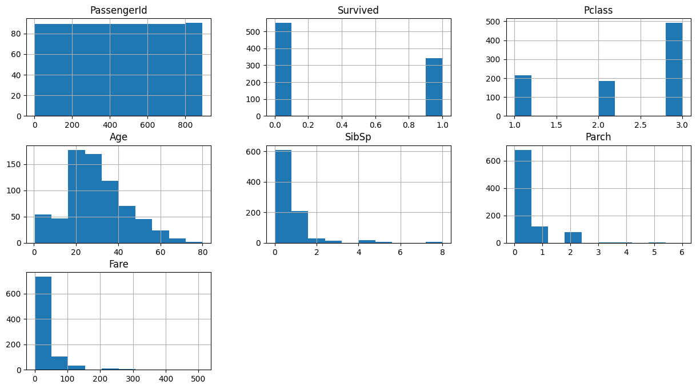
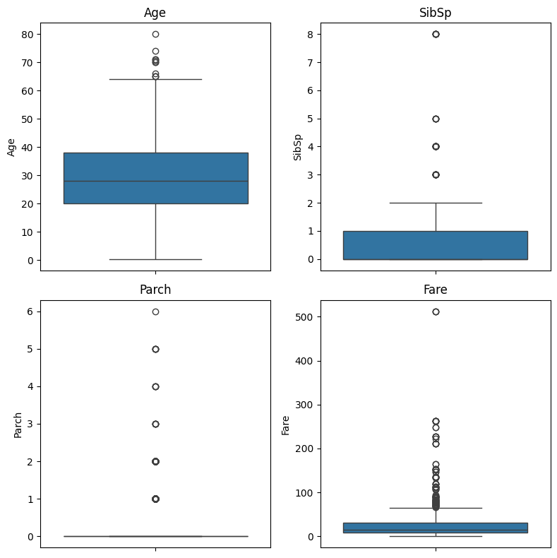

# Titanic Survival Prediction
This project builds several classification models that predicts survival of travellers in the titanic shipreck. this project involves detailed preprocessing, cleaning, model training and model evaluation.

---

## Goal
Build an optimum classification model to predict survival of passenegers in the titanic shipreck and evaluation of the models.

---

## PART 1: EXPLORATORY DATA ANALYSIS (EDA)
- The Data had a few missing data like in `Age = 177`, `Cabin = 687`, `Embarked = 2`
- The Numerical features includes:
    - 'PassengerId' : *passenger unique ID*
    - 'Survived' : *Target feature, `Yes` or `No`*
    - 'Pclass' : *Ticket class, `1: 1st` (high profile passenger), `2: 2nd` (midle class), `3: 3rd` (low-income class)*
    - 'Age' : *Age of each passengers*
    - 'SibSp' : *`Siblings/Spouses` - indicates the number of siblings or spouse accompanying the passenger. (brother, sister, husband, or wife)*
    - 'Parch' : *`Parent/Child` - indicates the number of parent or child accompanying the passenger. (Mother, father, daughter, son)*
    - 'Fare' : *This the ticket and total fare price*

 
      
- The distribution of the `target` feature showed an imbalanced class. With the ratio of surviving passenger to passengers who didnt survive being 3 to 5.
- Meanwhile, the `Pclass` column showed that there are more 3rd class ticket passengers than others.
- The distribution of the `Age` feature is r**ight-skewed**, with a large number of passengers in their 20s and 30s.
- column `SibSp` is **Extremely right-skewed** and heavily concentrated at 0 and 1. The vast majority traveled with zero or one sibling/spouse.
- column `Parch` is **Extremely right-skewed and heavily concentrated at 0**. Most passengers traveled with no parents or children.
- column `Fare` has a severely right-skewed distribution, with most fares below $50. This is typical, as 3rd class fares are low. Fares reach over $500, indicating passengers who paid for luxury cabins (1st class) skew the mean significantly. This feature will definitely need Log transformation.

